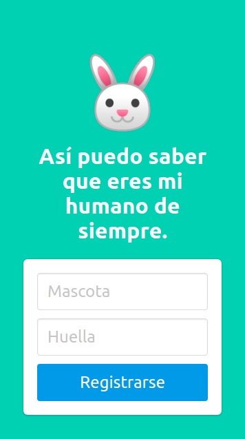
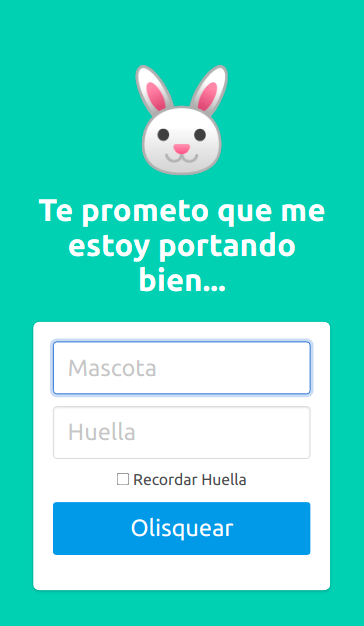
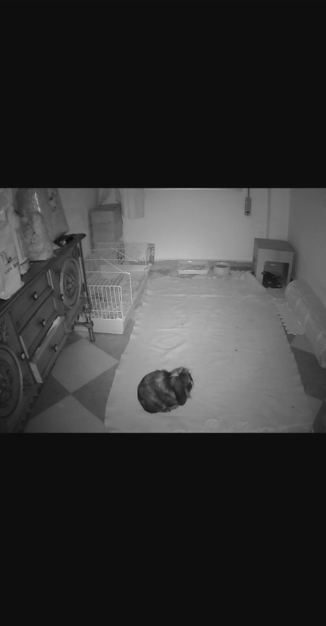

# Web APP Vigiladora de Mascotas

El objetivo es crear un sistema de videovigilancia casero usando **Flask** y **OpenCV**.

Para así poder saber que los pequeñines de la casa están bien :rabbit: :cat: :dog: :heart:.

Registro             |  Login  |  Cámara
:-------------------------:|:-------------------------:|:-------------------------:
  |    | 

Este proyecto ha sido basado en su gran totalidad en [este tutorial de login con Flask](https://www.digitalocean.com/community/tutorials/how-to-add-authentication-to-your-app-with-flask-login-es) y en [este tutorial de integración con OpenCV](https://www.odoo.com/es_ES/forum/ayuda-1/how-to-live-rtsp-camera-in-odoo-130159).

## Instalación

### 1. Descarga el repositorio y ve al root

```
cd flask_ipcamera/
```

### 2. Crear un entorno virtual
```
virtualenv venv
source venv/bin/activate
```

### 3. Instala los paquetes necesarios

```
pip install -r requirements.txt
```

### 4. Configura las variables de Flask

```
export FLASK_APP=flask_ipcamera
export FLASK_DEBUG=1
```

### 5. Inicializa la base de datos

En una consola de python desde la ubicación donde se ha descargado el repositorio:

```
cd ..
python
```
En la consola:
```
>>> from flask_ipcamera import db, create_app
>>> db.create_all(app=create_app())
```

### 6. Inicializa la aplicación

No olvides tener conectada la cámara.
Lanzar el servidor:

```
flask run -h 0.0.0.0
```

### 7. Disfruta

En el *browser* introduce:

```
127.0.0.1:5000/
```

O bien introduce la IP de la máquina donde se esté ejecutando en lugar de 0.0.0.0 para poder verlo desde cualquier dispositivo.